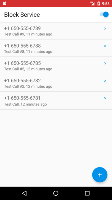
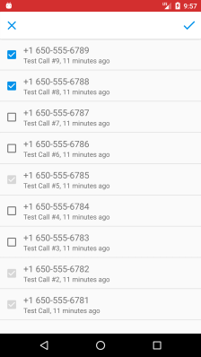

# Android-CBlock

#### Android application to block annoying incoming calls:

 &nbsp;&nbsp;&nbsp;&nbsp; 

#### Add phone in block list in 3 clicks:

1. Click floating button `add`
2. Select phones from incoming calls list and click `done`
3. Click switch `Block Service`

When Service is enabled, notification appears at the system bar.

#### How to install

Please use [app/app-release.apk](./app/app-release.apk) file.

#### Used language and libraries
 * [Kotlin](https://kotlinlang.org/docs/tutorials/kotlin-android.html) - do more with less lines of code
 * [RxJava](https://github.com/ReactiveX/RxJava), [RxAndroid](https://github.com/ReactiveX/RxAndroid) - the core of [MVVM](https://en.wikipedia.org/wiki/Model%E2%80%93view%E2%80%93viewmodel) architecture
 * [Dagger](https://google.github.io/dagger/) - dependency injection framework
 * [SQLBrite](https://github.com/square/sqlbrite) - wrapper around ContentResolver, to get incoming calls list
 * [GreenDao](http://greenrobot.org/greendao/) - ORM, to save blocked phone's numbers in local DB
